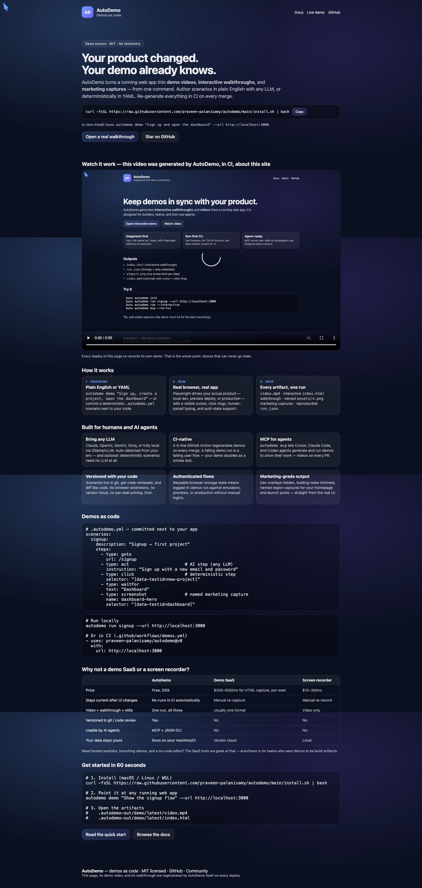

<div align="center">

# AutoDemo

**Demos as code.** Turn any running web app into demo videos, interactive walkthroughs, and marketing captures — in one command. Regenerated by CI, so they can never go stale.

[](https://github.com/praveen-palanisamy/autodemo/actions/workflows/ci.yml)
[](https://www.npmjs.com/package/autodemo)
[](LICENSE)
[](docs/AGENTS.md)

[Product page](https://praveen-palanisamy.github.io/autodemo/) · [Quick start](#quick-start) · [GitHub Action](docs/GITHUB_ACTION.md) · [For AI agents](docs/AGENTS.md) · [Recipes](docs/RECIPES.md) · [Contributing](CONTRIBUTING.md)

</div>

---

```bash
autodemo demo "Sign up and open the dashboard" --url http://localhost:3000
```

That single command drives a real browser through your real app and produces:

| Artifact | What it's for |
| --- | --- |
| `video.mp4` | launch posts, landing pages, PR descriptions — cursor, click rings, human-paced typing |
| `index.html` | static, embeddable **interactive walkthrough** (step screenshots + notes, keyboard navigable) |
| `assets/*.png` | **named marketing captures** of real UI regions, for homepages and decks |
| `run.json` | reproducible metadata — timings, steps, artifact contract for tooling |

The teaser below was generated by AutoDemo, about its own product page, in CI:

[](https://praveen-palanisamy.github.io/autodemo/demos/site-landing/latest/video.mp4)

## Why

Demos and screenshots rot the moment the UI changes. Re-recording them is manual, slow, and always last on the list. Interactive-demo SaaS tools fix freshness with $300–500/month plans, per-seat pricing, and a browser extension that captures snapshots into their cloud.

AutoDemo treats demos like the rest of your software:

- **Versioned** — scenarios are YAML in your repo, reviewed like code
- **Reproducible** — deterministic Playwright steps, or AI steps when you want speed
- **Continuous** — a [5-line GitHub Action](docs/GITHUB_ACTION.md) regenerates everything on merge; a failing demo is a failing user flow
- **Yours** — runs on your machine and your CI; no cloud, no telemetry, MIT licensed

## Quick start

**One-line install** (macOS / Linux / WSL — installs Bun, the CLI, and a browser):

```bash
curl -fsSL https://raw.githubusercontent.com/praveen-palanisamy/autodemo/main/install.sh | bash
```

Or zero-install / per-project:

```bash
bunx autodemo --help          # Bun
npm add -D autodemo           # or as a dev dependency
bunx playwright install chromium
```

### 1. The magic moment (AI-authored)

With any LLM key in your env (`ANTHROPIC_API_KEY`, `OPENAI_API_KEY`, `GOOGLE_API_KEY`, `GROQ_API_KEY` — or a local `OLLAMA_HOST`, auto-detected):

```bash
autodemo demo "Sign up, create a project, open the dashboard" --url http://localhost:3000
```

Watch the browser do it, then open the printed `video.mp4` and walkthrough. Add `--save` to keep the scenario for replay.

### 2. Deterministic demos (no LLM needed)

```bash
autodemo init   # writes a commented .autodemo.yml
```

```yaml
scenarios:
  signup:
    description: "Signup with readable typing and click highlights"
    steps:
      - type: goto
        url: /signup
      - type: fill
        selector: "[data-testid=email]"
        value: "maya@example.com"
        typing: true
      - type: click
        selector: "[data-testid=submit]"
      - type: waitFor
        text: "Dashboard"
      - type: screenshot
        name: dashboard-hero
        selector: "[data-testid=dashboard]"
```

```bash
autodemo run signup --url http://localhost:3000          # one scenario
autodemo run --all --url http://localhost:3000 --headless # all of them (CI)
```

### 3. Keep them fresh forever (CI)

```yaml
- uses: praveen-palanisamy/autodemo@v0
  with:
    url: http://localhost:3000
```

Full inputs and recipes: [docs/GITHUB_ACTION.md](docs/GITHUB_ACTION.md).

## For AI agents

AutoDemo is agent-native: coding agents use it to **show their work** — a demo video on every PR.

```bash
bunx autodemo mcp --no-tui    # MCP server over stdio
```

One-line registration for Cursor / Claude Code / Codex, JSON CLI contracts, and a drop-in rules snippet: [docs/AGENTS.md](docs/AGENTS.md).

## Features

- **Any LLM, or none** — OpenAI, Anthropic, Google, Groq, Ollama/local, any OpenAI-compatible endpoint; deterministic scenarios need zero keys
- **Authenticated flows** — reusable browser storage state; login once, demo logged-in forever
- **Marketing-grade output** — dev overlays hidden, loading noise trimmed (`videoStartStep`), named region captures, custom cursor & click highlights
- **Story tools** — on-screen `narrate` beats, per-step notes in walkthroughs
- **Interactive TUI** — wizards for recording and running (`autodemo record --interactive`)
- **CI-grade** — `--json` output, stable exit codes, `trace.zip` on failure, artifacts contract in `run.json`

## How it compares

| | **AutoDemo** | Demo SaaS (Supademo, Arcade, Storylane…) | Screen recorders |
| --- | --- | --- | --- |
| Price | Free, OSS | $300–500/mo for HTML capture, per-seat | $10–30/mo |
| Freshness | Regenerated in CI | Manual re-capture | Manual re-record |
| Output | Video + walkthrough + stills, one run | Usually one format | Video only |
| In git / code review | ✅ | ❌ | ❌ |
| Agent-operable (MCP) | ✅ | ❌ | ❌ |

The SaaS tools are great for no-code editing, analytics, and hosted demo hubs. AutoDemo is for teams who want demos to be **build artifacts**.

## Docs

| | |
| --- | --- |
| [CLI reference](docs/CLI.md) | commands, flags, exit codes |
| [Configuration](docs/CONFIG.md) | `.autodemo.yml`, step types, LLM providers, auth state |
| [GitHub Action](docs/GITHUB_ACTION.md) | demos in CI |
| [AI agents](docs/AGENTS.md) | MCP setup, JSON CLI, rules snippet |
| [Recipes](docs/RECIPES.md) | copy-paste scenarios |
| [Architecture](docs/ARCHITECTURE.md) | engines, runner, artifact pipeline |
| [Testing](docs/TESTING.md) · [Local CI](docs/CI_LOCAL.md) | development workflows |

## Requirements

- [Bun](https://bun.sh) ≥ 1.3 (the installer sets it up)
- Playwright Chromium (one-time `bunx playwright install chromium`)
- `ffmpeg` for MP4 export (optional — everything else works without it)

## Contributing

The 15-minute setup, project tour, and `good first issue` list live in [CONTRIBUTING.md](CONTRIBUTING.md). The lowest-friction contribution is a [scenario recipe](https://github.com/praveen-palanisamy/autodemo/issues/new/choose).

```bash
bun install && bun run playwright:install
bun test && bun run lint && bun run typecheck
```

## License

[MIT](LICENSE) © Praveen Palanisamy and AutoDemo contributors.

---

<div align="center">
<sub>This README's teaser, the <a href="https://praveen-palanisamy.github.io/autodemo/">product page</a>, and its demo videos are all generated by AutoDemo itself — on every deploy.</sub>
</div>
